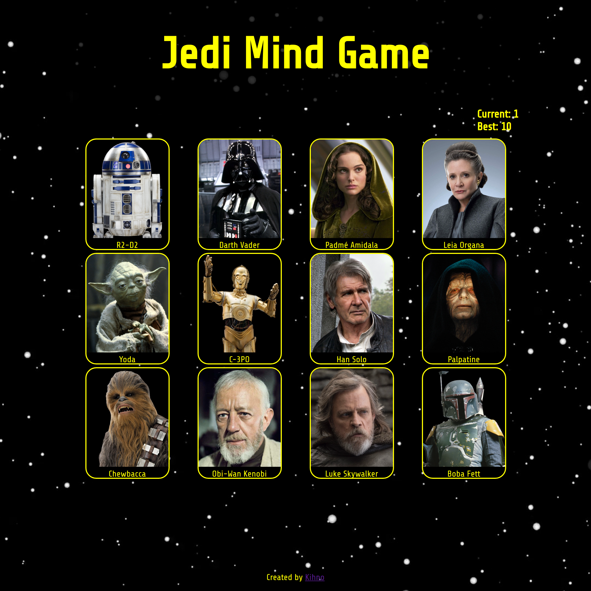

# Memory Game

https://kihno.github.io/memory-game/

## Description

A Star Wars themed memory card game built with React.

## Built With

- React

## Features

- Cards are randomly shuffled when a card is clicked
- Click all 12 cards without selecting a repeat to bank the highest score
- Character images and names fetched from [Star Wars API](https://github.com/akabab/starwars-api)
- Responsive grid for mobile, tablet, and monitor

## Acknowledgements

Built as part of [The Odin Project](https://www.theodinproject.com/) full stack curriculm.

[Star Wars API](https://github.com/akabab/starwars-api)